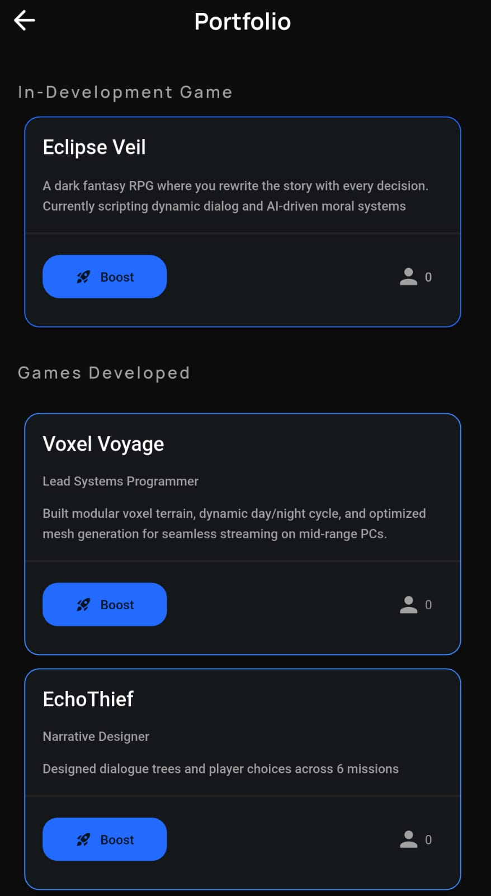
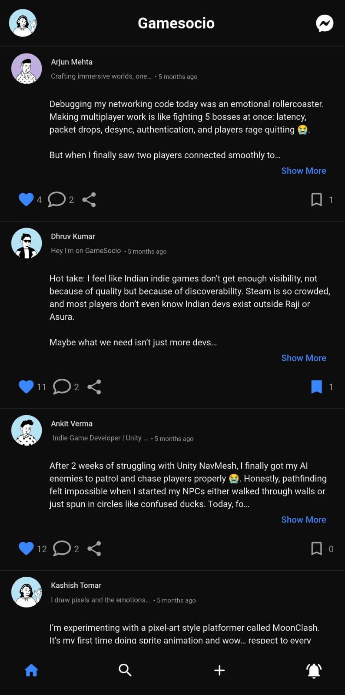

  <h1>
    GameSocio 
    <!--  -->
  </h1>
  
<strong>The Professional Network for Game Developers</strong>

  
  
Connect • Showcase • Collaborate

  

    
    &nbsp;
    
    &nbsp;
    
  

   
   

  <h1>
    <a href="https://github.com/NavneetKumar-GS/GameSocio-App/releases/tag/v1.0.0">
      🚀 Download Alpha APK
    </a>
  </h1>
  
<em>Latest Version: v1.0.0 (Alpha)</em>

---

## 👋 What is GameSocio?
GameSocio is India's first platform dedicated to solving the **Visibility Crisis** for indie game developers. 

We are not just another social media app. We are a utility tool designed to help you:
* **Showcase Work:** Share `itch.io` links and prototypes, not just photos.
* **Find Your Squad:** Locate Unity devs, Pixel artists, and Composers near you.
* **Get Feedback:** Real constructive criticism from actual developers, not bots.

---

## 📸 Sneak Peek
| **Dev Portfolio** | **Community Feed** |
|:---:|:---:|
|  |  |

---

## 🐛 Found a Bug?
This is an **Alpha Build**, so things might break! (That's why you are here 😉).
If you find a crash or a glitch:
1.  Go to the [Issues Tab](LINK_TO_ISSUES_TAB).
2.  Click **New Issue**.
3.  Tell me what happened!

---

  Built with ❤️ by Navneet Kumar

